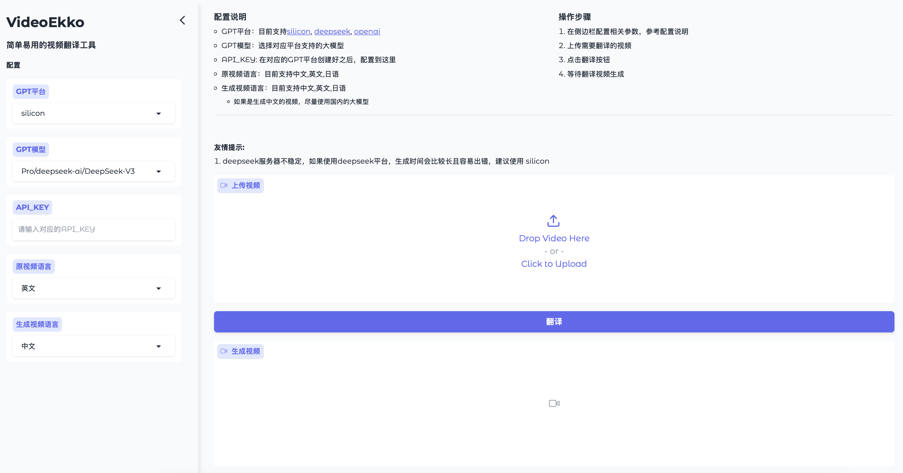
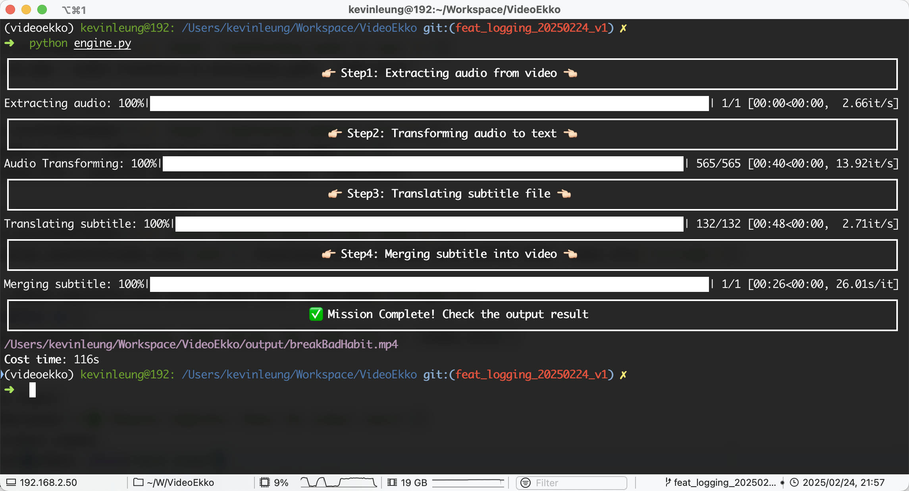

# 👉🏻 VideoEkko 👈🏻 [开发阶段]

[](https://github.com/Akshay090/svg-banners)

## 👍🏻 简介
VideoEkko — 快速为您的视频添加翻译字幕
* 简单配置，轻松上手
* 高效生成，节省时间
* 支持多语言翻译，全球通用
* 一键安装与部署，免去繁琐步骤
* 兼容多种 GPT 集成平台

## 👀 Demo

<table>
<tr>
<td>

### 原视频
---
https://github.com/user-attachments/assets/6eeb80dc-d85c-4d33-822c-4dda14a9d58f

</td>
<td>

### 生成视频
---
https://github.com/user-attachments/assets/d6c4e463-d719-41b1-bb61-c05e51009172

</td>
</tr>
</table>


## 💁🏻 操作界面

<table>
<tr>
<td width="50%">

### Web
---


</td>

<td width="50%">

### Command
---


</td>
</tr>
</table>

## 🥳 安装方法
VideoEkko 依赖 **ffmpeg** 和 **whisper**

### 一键安装
```shell
conda -n videoekko -y python=3.12
conda activate videoekko
python install.py
```

### 手动安装依赖
1. **安装 [ffmpeg](https://www.ffmpeg.org)** 

Ubuntu/Debian
```shell
sudo apt install -y ffmpeg
```

CentOS/Fedora

```shell
sudo yum install -y ffmpeg
```

MacOS

```shell
brew install ffmpeg
```

2. **安装 [whisper](https://github.com/openai/whisper)** 

```shell
pip install -U openai-whisper
```

3. **安装依赖包** 

```shell
pip install -r requirements.txt
```

## 🛠️ 使用方法

### WEB 页面

```shell
python web.py
```
浏览器打开
> localhost:7860

### 命令行

**操作步骤** 

1. 将需要操作的视频放进 source 文件夹中
2. 在 conf.yaml 文件中配置

```yaml
# 原视频语言: English, Chinese, Japanese 区分大小写
src_lang: English
# 生成视频语言: English, Chinese, Japanese 区分大小写
target_lang: Chinese

gpt:
  # GPT平台: silicon, deepseek, openai 区分大小写
  platform: deepseek
  # API_KEY
  apiKey: xxxxxx
  # GPT 模型
  model: deepseek-chat
  
# whisper 配置
whisper:
  # tiny, base, small, medium, large, turboe
  model: turbo
```

3. 执行 engine.py

```shell
python engine.py
```


## 🤔 参考
* [Gradio](https://www.gradio.app)
* [whisper](https://github.com/openai/whisper)

## License
VideoEkko is released under the MIT License. See [LICENSE](./LICENSE) for further details.
