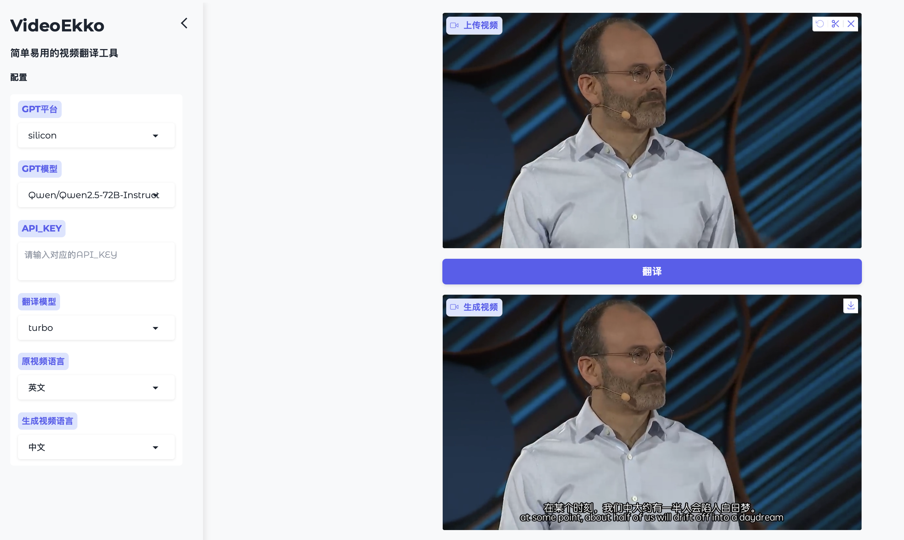

# VideoEkko [开发阶段]

## 简介
VideoEkko 是一款简单易用，高性能的视频翻译工具，由 AI 作为翻译内核，译文更精准，流畅

* 支持多语种翻译
* 支持一键安装部署
* 支持多 GPT 集成平台

## 操作界面



## 性能展示

pass

## 安装方法

**依赖包** 

**whisper**

github: [whisper](https://github.com/openai/whisper)

```shell
pip install -U openai-whisper
```

**ffmpeg**

参考官方文档：[ffmpeg](https://www.ffmpeg.org)

```shell
conda -n videoekko -y python=3.12
conda activate videoekko
python install.py
```

## 使用方法

```shell
python web.py
```
浏览器打开
> localhost:7860

## 参考
* [Gradio](https://www.gradio.app)
* [whisper](https://github.com/openai/whisper)

## License
VideoEkko is released under the MIT License. See [LICENSE](./LICENSE) for further details.